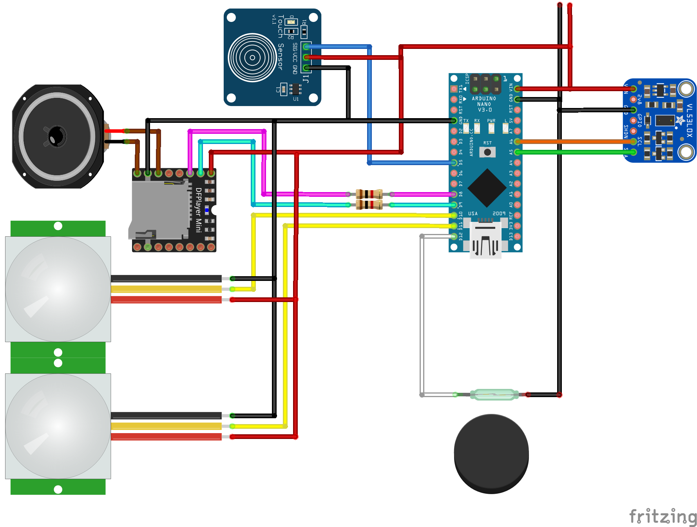

# Jumanji-BAR
шкафчик-бар, дверцы в стиле Джуманджи, с озвучкой (бой барабанов) и подсветкой

> [!WARNING]
> проект только начинается, и планируется завершить его к Маю 2022...

# Задумка
Сделать шкаф-бар (для алкоголя) стилизованного под Джуманджи. 
При появлении рядом кого-либо включается барабанный бой с постепеенным нарастанием громкости 
При приближении - громкость и барабанный бой меняются до максимально громкого 
При прикосновении к шкафчику бой прекращается. 
При открытии, включается подсветка в шкафчике, (можно включить саундтрек Jumanji) 
При закрытии и отходе от шкафа, барабаны негромко и недолго снова играют. 

[3D model](https://www.thingiverse.com/thing:2410181)

# План действий
- барабанный бой можной найти в фильме, на 23-24 минутах, где дети поднимаются по лестнице и находят коробку.
Бой поделен на 4 части по интенсивности звучания:
    - далекий (дети слышат его внизу)
    - средний (дети входят в комнату)
    - близкий (страшно аж жуть)
    - завершение (последние пара ударов в барабан)
- шкаф будет изготовлен из дерева, с фрезерованием на станке с ЧПУ.
- музыкальная и интерактивная часть планируется с использованием Arduino Nano, прошивка которой и будет здесь представлена.

# Компоненты
- Arduino Nano
- DFPlayer mini
- PIR (mini) sensor (x2)
- Distance sensor VL53L0X
- Touch sensor TTP223 (x2)
- Speaker 3W
- WS2812 strip (подсветка внутри, опционально)
- DC 5V 3A

при срабатывании ПИР1 датчика, включаем бой барабанов, с увеличением громкости от тихого до полного,  
если сработал ПИР2 датчик (более направленного/ближнего радиуса действия) или при срабатывании дальномера VL57 включается бой барабанов 2 (средний) 
при приближении до полуметра (дальномер VL53L0X), бой 3 (самый сильный) 
при прикосновении к ТАЧ-сенсору, бой барабанов замолкает 

# Потенциальные проблемы
|проблема|решение|
|------|------|
|Пир определяет движение, а не присутствие|да и хрен с ним, если движение регистрируется долго или многократно, но никто не подходит, то отключать датчики ПИР, оставлять толдько дальномер, если кто-то приблизился совсем близко или открыл ящик - включать ПИРы снова|
|Датчик расстояния VL53L0X узкий, а шкаф - широкий, как определять полное приближение с любой стороны?| два, три датчика (???)|
|Касание по всей поверхности деревянного ящика не сделать, а ручек нет|Ручки есть, углубления по бокам, ставить сенсоры касания туда|
|В ночное время барабаны могут мешать спать|Громкость регулировать Ящик отключать Датчик освещения или часы Всё выше сказанное вместе|
|В зависимости от размещения шкафа, оба датчика PIR могут срабатывать одновременно при появлении человека|Нужна регулировка области видимости второго датчика, шторка или поворот (врезать в дверцу уже не вариант)|
|Недостаточно мощный звук при питании от 5в, а усилитель и динамики большего размера негде размещать и прятать||
|Круглый дисплей внутри коробки, с анимацияями и пр. - дорого и сложно|Линза, трафарет с текстом "джуманжи" и переливающаяся подсветка|

# Звуки
в папке mp3 лежат
- оригинальный фрагмент из фильма
- папка 01 - её следует скопировать на microSD, прямо как есть - папкой
> [!WARNING]
> Файлы удлинены и отредактированы наспех, для попробовать. Это временный вариант.

(ПРОДОЛЖЕНИЕ СЛЕДУЕТ)